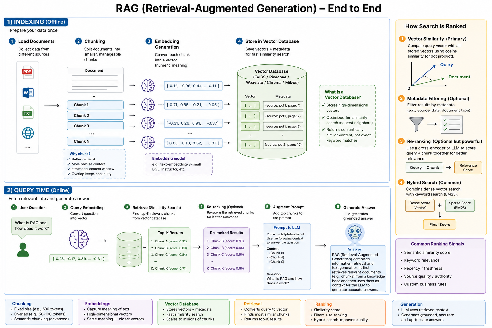
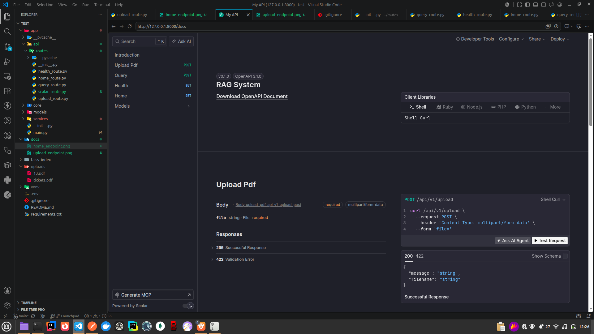
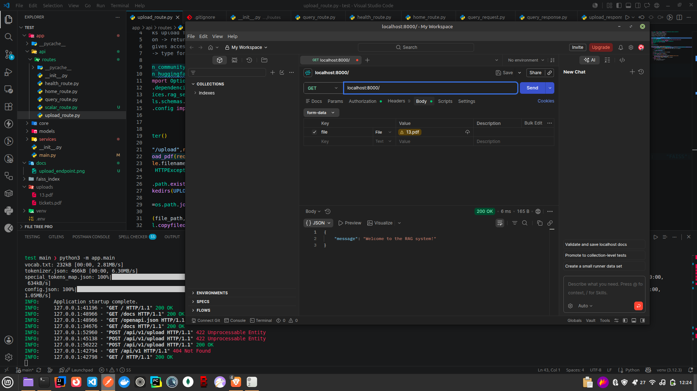
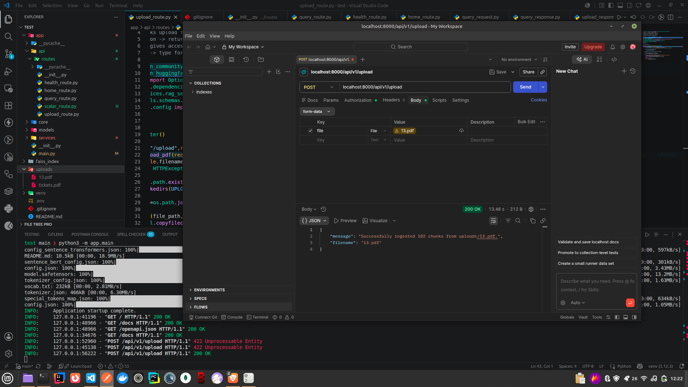
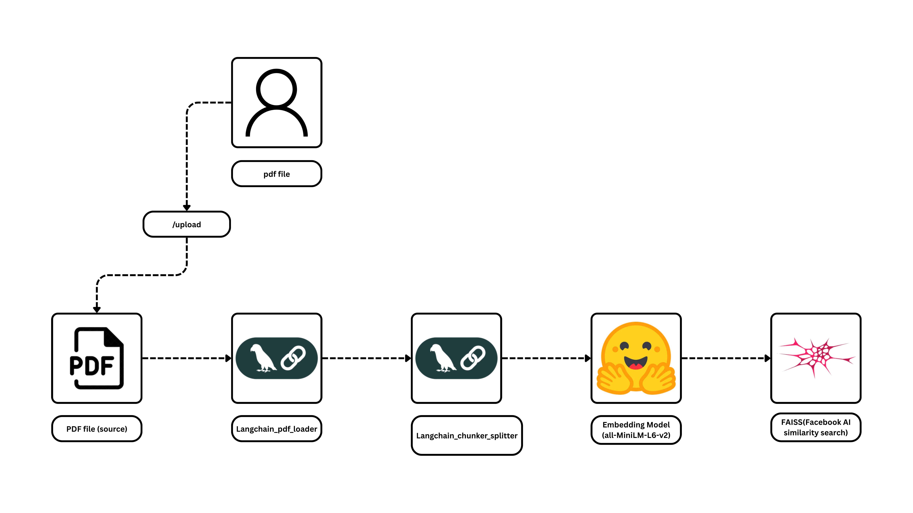
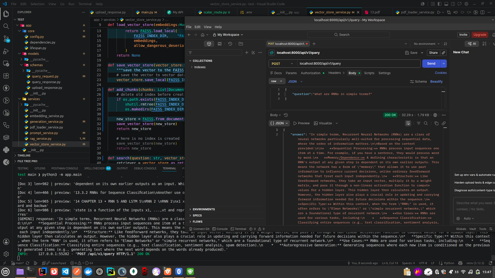
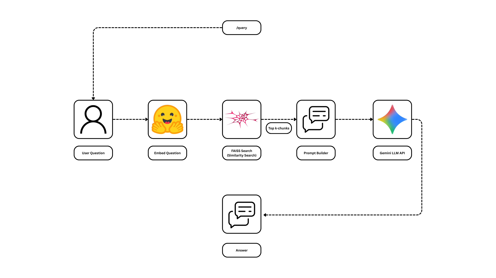

# RAG-based PDF Query API

## Description

This project provides a Retrieval-Augmented Generation (RAG) API built with FastAPI. It allows users to upload PDF documents, ingest them into a vector store (FAISS), and perform intelligent queries against the content of these documents.

## Features

- **PDF Ingestion:** Easily upload and parse PDF documents.
- **Vector Search:** Uses FAISS for efficient storage and retrieval of document chunks.
- **Intelligent Querying:** Leverages RAG to provide context-aware answers to user queries based on the uploaded PDFs.
- **FastAPI Backend:** A lightweight, high-performance API structure.

## Architecture



## Prerequisites

- Python 3.10+
- Dependencies listed in `requirements.txt`

## Installation and Running

1. **Clone the repository.**

2. **Install dependencies:**

   ```bash
   pip install -r requirements.txt
   ```

3. **Run the application:**

   ```bash
   python -m app.main
   ```

## Configuration

*(Add details about environment variables or configuration files if applicable)*

## Usage

*(Provide examples of how to interact with the API endpoints)*

## Project Structure

- `app/`: Contains the FastAPI application logic.
  - `api/routes/`: API endpoints (`upload`, `query`, etc.)
  - `core/`: Configuration and dependency management.
  - `models/`: Pydantic schemas for request/response validation.
  - `services/`: Core logic for PDF processing, embeddings, RAG, and vector store management.

## API Documentation



### Endpoints

- **Home:** 
- **Upload:**
  - Endpoint: 
  - Details: 
- **Query:**
  - Endpoint: 
  - Details: 

## Troubleshooting

*(Add common issues and their solutions here)*

## Contributing

Contributions are welcome! Please open an issue or submit a pull request.

## License

This project is licensed under the MIT License.

## Recent Updates

- Added demo video.
- Improved documentation and API explanations.
- Added file deletion support in the upload router.
- Fixed embedding issues.

### Demo Video 

### backend 

------
### frontend
